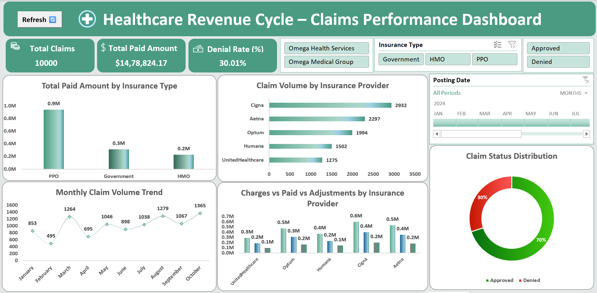

# Healthcare Claims Data Analysis — Advanced Excel Dashboard

> Milestone 1 | Skillryt Data Analytics Program | KGiSL MicroCollege

An end-to-end Healthcare Revenue Cycle Claims Analysis built using Microsoft Excel across 10,000 claims records — covering data cleaning, KPI calculations, PivotTable analysis, scenario modeling, macro automation, and Power Pivot data modeling.

**Tools:** Excel · Power Query · Power Pivot · DAX · PivotTables · VBA Macros

---

## Dashboard preview

---

## Key metrics

| Metric | Value |
|--------|-------|
| Total Claims | 10,000 |
| Total Paid Amount | $14,78,824 |
| Denial Rate | 30.01% |
| Top Insurance Provider | Cigna — 2,932 claims (29.3% of volume) |
| Highest Paid Type | PPO — $0.9M (60%+ of payouts) |

---

## Data cleaning — Power Query

| Step | Action |
|------|--------|
| Remove Duplicates | Duplicate claim records removed |
| Missing Values | Critical nulls reviewed; adj codes → "Not Specified" |
| Date Standardization | DOS converted to consistent date format |
| Financial Validation | Paid ≤ Allowed ≤ Charge verified |
| Column Renaming | All columns renamed for clarity |
| Data Types | Monetary, date, and code fields standardized |

---

## Power Pivot — Data model

| Table | Description |
|-------|-------------|
| Cleaned_data | Main claims fact table — 10,000 records |
| Insurance_Master | Insurance dimension table |

DAX measures created: Total Claims Count · Total Paid Amount · Denied Claims Count · Denial Rate % · Average Payment Rate

---

## Excel features used

| Feature | Purpose |
|---------|---------|
| Power Query | Data import, cleaning, transformation |
| Power Pivot | Data model — Cleaned_data + Insurance_Master |
| DAX Measures | KPI calculations — denial rate, paid amount, claim count |
| PivotTables | 5 pivot sheets — Insurance, Volume, Trend, Financials, Denial |
| PivotCharts | Bar, Line, Column, Combo charts |
| Dashboard | Interactive — KPI cards, slicers, timeline |
| What-If Analysis | Denial rate impact simulation |
| Goal Seek | Target paid amount calculation |
| Scenario Manager | Low / Moderate / High denial scenarios |
| Macros (VBA) | `Reset_All_Filters_Final` — auto refresh + slicer reset |
| Formulas | SUM, COUNT, COUNTIF, IF, IFERROR, VLOOKUP |

---

## Scenario analysis

| Scenario | Denial Rate | Paid Amount |
|----------|-------------|-------------|
| Low Denial | 10% | $9,00,000 |
| Moderate Denial | 30% | $7,00,000 |
| High Denial | 40% | $6,00,000 |

---

## Key insights

1. PPO leads with $0.9M paid — 60%+ of total insurance payouts
2. 30.01% denial rate is critically high — ~$4.4L in revenue leakage identified
3. Cigna handles 2,932 claims — 29.3% of total claim volume
4. February recorded the lowest monthly claim volume at 495
5. Adjustments form a major portion of the revenue gap between charged and paid amounts

---

## Recommendations

| Priority | Action |
|----------|--------|
| HIGH | Reduce denial rate from 30% to below 15% through claims audit |
| HIGH | Focus on Cigna — highest volume, optimize processing pipeline |
| MED | Investigate February volume drop — staffing or seasonal issue |
| MED | Renegotiate HMO contracts — lowest paid amount among all types |
| LOW | Automate monthly reporting using existing Macro framework |

---

## Repository structure

Healthcare-Claims-Data-Analysis/
│
├── Dashboard/
│   └── dashboard.png
│
├── Workbook/
│   └── DA_Healthcare_Revenue_Cycle_Claims_Dashboard.xlsm
│
├── Documentation/
│   └── DA_Healthcare_Claims_Analysis_Documentation.pdf
│
└── README.md

---

